# Predicting domestic violence in NSW

Python code to analyse and forecast domestic violence in NSW based on data from the NSW Bureau of Crime Statistics and Research.

# Loading libraries

Let's load relevant Python libraries.


```python
import numpy as np 
import pandas as pd 
import seaborn as sns 
import matplotlib.pyplot as plt 
import matplotlib as mpl
import pmdarima as pm
from statsmodels.tsa.stattools import adfuller, kpss
from statsmodels.tsa.stattools import acf, pacf
from statsmodels.graphics.tsaplots import plot_acf, plot_pacf
from statsmodels.tsa.seasonal import seasonal_decompose
import statsmodels.api as sm
import time
import warnings
warnings.filterwarnings("ignore")
```

# Loading data

The dataset was acquired from https://www.bocsar.nsw.gov.au/Pages/bocsar_datasets/Datasets-.aspxNSW. It contains monthly data on all criminal incidents recorded by police from 1995 to Mar 2020.


```python
data = pd.read_csv('Incident_by_NSW.csv')
```


```python
data.head()
```


<div>
<table border="1" class="dataframe">
  <thead>
    <tr style="text-align: right;">
      <th></th>
      <th>State</th>
      <th>Offence category</th>
      <th>Subcategory</th>
      <th>2019 population</th>
      <th>2020 population</th>
      <th>Jan 1995</th>
      <th>Feb 1995</th>
      <th>Mar 1995</th>
      <th>Apr 1995</th>
      <th>May 1995</th>
      <th>...</th>
      <th>Nov 2019</th>
      <th>Dec 2019</th>
      <th>Jan 2020</th>
      <th>Feb 2020</th>
      <th>Mar 2020</th>
      <th>Total for prev 12m</th>
      <th>Total for last 12m</th>
      <th>% change</th>
      <th>Kendall's trend test over 24m</th>
      <th>p-value for Kendall's trend test</th>
    </tr>
  </thead>
  <tbody>
    <tr>
      <th>0</th>
      <td>NSW</td>
      <td>Homicide</td>
      <td>Murder *</td>
      <td>7,988,241</td>
      <td>7,988,241</td>
      <td>9</td>
      <td>11</td>
      <td>10</td>
      <td>11</td>
      <td>7</td>
      <td>...</td>
      <td>8</td>
      <td>8</td>
      <td>8</td>
      <td>7</td>
      <td>6</td>
      <td>76</td>
      <td>74</td>
      <td>-2.6%</td>
      <td>0.13</td>
      <td>0.41</td>
    </tr>
    <tr>
      <th>1</th>
      <td>NSW</td>
      <td>Homicide</td>
      <td>Attempted murder</td>
      <td>7,988,241</td>
      <td>7,988,241</td>
      <td>1</td>
      <td>3</td>
      <td>4</td>
      <td>6</td>
      <td>5</td>
      <td>...</td>
      <td>4</td>
      <td>2</td>
      <td>4</td>
      <td>2</td>
      <td>2</td>
      <td>20</td>
      <td>29</td>
      <td>45.0%</td>
      <td>0.21</td>
      <td>0.18</td>
    </tr>
    <tr>
      <th>2</th>
      <td>NSW</td>
      <td>Homicide</td>
      <td>Murder accessory, conspiracy</td>
      <td>7,988,241</td>
      <td>7,988,241</td>
      <td>0</td>
      <td>2</td>
      <td>0</td>
      <td>0</td>
      <td>2</td>
      <td>...</td>
      <td>0</td>
      <td>0</td>
      <td>1</td>
      <td>0</td>
      <td>1</td>
      <td>2</td>
      <td>2</td>
      <td>0.0%</td>
      <td>0.15</td>
      <td>0.39</td>
    </tr>
    <tr>
      <th>3</th>
      <td>NSW</td>
      <td>Homicide</td>
      <td>Manslaughter *</td>
      <td>7,988,241</td>
      <td>7,988,241</td>
      <td>0</td>
      <td>2</td>
      <td>1</td>
      <td>2</td>
      <td>1</td>
      <td>...</td>
      <td>0</td>
      <td>1</td>
      <td>0</td>
      <td>1</td>
      <td>1</td>
      <td>12</td>
      <td>7</td>
      <td>-41.7%</td>
      <td>-0.08</td>
      <td>0.61</td>
    </tr>
    <tr>
      <th>4</th>
      <td>NSW</td>
      <td>Assault</td>
      <td>Domestic violence related assault</td>
      <td>7,988,241</td>
      <td>7,988,241</td>
      <td>613</td>
      <td>591</td>
      <td>625</td>
      <td>640</td>
      <td>602</td>
      <td>...</td>
      <td>2772</td>
      <td>3135</td>
      <td>3128</td>
      <td>2550</td>
      <td>2757</td>
      <td>30227</td>
      <td>31457</td>
      <td>4.1%</td>
      <td>0.48</td>
      <td>0.00</td>
    </tr>
  </tbody>
</table>
<p>5 rows × 313 columns</p>
</div>


# Cleaning data

Let's view all the columns to better understand the dataset.


```python
data.columns
```


    Index(['State', 'Offence category', 'Subcategory', '2019 population',
           '2020 population', 'Jan 1995', 'Feb 1995', 'Mar 1995', 'Apr 1995',
           'May 1995',
           ...
           'Nov 2019', 'Dec 2019', 'Jan 2020', 'Feb 2020', 'Mar 2020',
           'Total for prev 12m', 'Total for last 12m', '% change',
           'Kendall's trend test over 24m', 'p-value for Kendall's trend test'],
          dtype='object', length=313)


```python
data.describe()
```


<div>
<table border="1" class="dataframe">
  <thead>
    <tr style="text-align: right;">
      <th></th>
      <th>Jan 1995</th>
      <th>Feb 1995</th>
      <th>Mar 1995</th>
      <th>Apr 1995</th>
      <th>May 1995</th>
      <th>Jun 1995</th>
      <th>Jul 1995</th>
      <th>Aug 1995</th>
      <th>Sep 1995</th>
      <th>Oct 1995</th>
      <th>...</th>
      <th>Oct 2019</th>
      <th>Nov 2019</th>
      <th>Dec 2019</th>
      <th>Jan 2020</th>
      <th>Feb 2020</th>
      <th>Mar 2020</th>
      <th>Total for prev 12m</th>
      <th>Total for last 12m</th>
      <th>Kendall's trend test over 24m</th>
      <th>p-value for Kendall's trend test</th>
    </tr>
  </thead>
  <tbody>
    <tr>
      <th>count</th>
      <td>62.000000</td>
      <td>62.000000</td>
      <td>62.000000</td>
      <td>62.000000</td>
      <td>62.000000</td>
      <td>62.000000</td>
      <td>62.000000</td>
      <td>62.000000</td>
      <td>62.000000</td>
      <td>62.000000</td>
      <td>...</td>
      <td>62.000000</td>
      <td>62.000000</td>
      <td>62.000000</td>
      <td>62.000000</td>
      <td>62.000000</td>
      <td>62.000000</td>
      <td>62.000000</td>
      <td>62.000000</td>
      <td>62.000000</td>
      <td>62.000000</td>
    </tr>
    <tr>
      <th>mean</th>
      <td>708.564516</td>
      <td>644.080645</td>
      <td>715.419355</td>
      <td>657.338710</td>
      <td>680.080645</td>
      <td>670.838710</td>
      <td>693.064516</td>
      <td>727.048387</td>
      <td>732.338710</td>
      <td>788.274194</td>
      <td>...</td>
      <td>984.096774</td>
      <td>983.145161</td>
      <td>993.806452</td>
      <td>976.080645</td>
      <td>899.016129</td>
      <td>903.887097</td>
      <td>11163.145161</td>
      <td>11385.548387</td>
      <td>0.131774</td>
      <td>0.285806</td>
    </tr>
    <tr>
      <th>std</th>
      <td>1370.802728</td>
      <td>1227.628853</td>
      <td>1346.122477</td>
      <td>1237.212837</td>
      <td>1293.323769</td>
      <td>1282.058248</td>
      <td>1351.772799</td>
      <td>1394.149467</td>
      <td>1430.292277</td>
      <td>1545.542880</td>
      <td>...</td>
      <td>1654.707608</td>
      <td>1644.746927</td>
      <td>1631.558712</td>
      <td>1571.838876</td>
      <td>1463.765350</td>
      <td>1396.545212</td>
      <td>18877.220406</td>
      <td>18825.634454</td>
      <td>0.263846</td>
      <td>0.287508</td>
    </tr>
    <tr>
      <th>min</th>
      <td>0.000000</td>
      <td>0.000000</td>
      <td>0.000000</td>
      <td>0.000000</td>
      <td>0.000000</td>
      <td>0.000000</td>
      <td>0.000000</td>
      <td>0.000000</td>
      <td>0.000000</td>
      <td>0.000000</td>
      <td>...</td>
      <td>0.000000</td>
      <td>0.000000</td>
      <td>0.000000</td>
      <td>0.000000</td>
      <td>0.000000</td>
      <td>1.000000</td>
      <td>2.000000</td>
      <td>2.000000</td>
      <td>-0.430000</td>
      <td>0.000000</td>
    </tr>
    <tr>
      <th>25%</th>
      <td>22.000000</td>
      <td>18.500000</td>
      <td>25.750000</td>
      <td>22.500000</td>
      <td>20.750000</td>
      <td>16.250000</td>
      <td>21.250000</td>
      <td>23.000000</td>
      <td>23.250000</td>
      <td>22.250000</td>
      <td>...</td>
      <td>52.250000</td>
      <td>66.500000</td>
      <td>43.000000</td>
      <td>48.500000</td>
      <td>53.500000</td>
      <td>50.500000</td>
      <td>604.250000</td>
      <td>649.250000</td>
      <td>-0.067500</td>
      <td>0.010000</td>
    </tr>
    <tr>
      <th>50%</th>
      <td>172.500000</td>
      <td>140.500000</td>
      <td>153.000000</td>
      <td>160.500000</td>
      <td>143.500000</td>
      <td>134.500000</td>
      <td>149.500000</td>
      <td>147.500000</td>
      <td>147.000000</td>
      <td>169.000000</td>
      <td>...</td>
      <td>231.500000</td>
      <td>237.000000</td>
      <td>279.500000</td>
      <td>265.000000</td>
      <td>236.500000</td>
      <td>208.500000</td>
      <td>2740.500000</td>
      <td>2525.500000</td>
      <td>0.130000</td>
      <td>0.205000</td>
    </tr>
    <tr>
      <th>75%</th>
      <td>417.000000</td>
      <td>416.000000</td>
      <td>469.500000</td>
      <td>422.750000</td>
      <td>453.500000</td>
      <td>489.000000</td>
      <td>485.750000</td>
      <td>546.000000</td>
      <td>547.500000</td>
      <td>513.250000</td>
      <td>...</td>
      <td>1212.500000</td>
      <td>1200.000000</td>
      <td>1265.000000</td>
      <td>1274.250000</td>
      <td>1054.000000</td>
      <td>1277.500000</td>
      <td>14327.500000</td>
      <td>14349.000000</td>
      <td>0.357500</td>
      <td>0.512500</td>
    </tr>
    <tr>
      <th>max</th>
      <td>6183.000000</td>
      <td>5352.000000</td>
      <td>5755.000000</td>
      <td>5531.000000</td>
      <td>5742.000000</td>
      <td>5611.000000</td>
      <td>6228.000000</td>
      <td>5794.000000</td>
      <td>6163.000000</td>
      <td>6869.000000</td>
      <td>...</td>
      <td>9656.000000</td>
      <td>9931.000000</td>
      <td>9543.000000</td>
      <td>8860.000000</td>
      <td>8242.000000</td>
      <td>7114.000000</td>
      <td>112907.000000</td>
      <td>110111.000000</td>
      <td>0.700000</td>
      <td>0.920000</td>
    </tr>
  </tbody>
</table>
<p>8 rows × 307 columns</p>
</div>


```python
data.info()
```

    <class 'pandas.core.frame.DataFrame'>
    RangeIndex: 62 entries, 0 to 61
    Columns: 313 entries, State to p-value for Kendall's trend test
    dtypes: float64(2), int64(305), object(6)
    memory usage: 151.7+ KB
    

Let's explore 'Offence category' and 'Subcategory'


```python
diagram = sns.countplot(x='Offence category', data=data)
diagram.set_xticklabels(diagram.get_xticklabels(), rotation=40, ha="right")
```


    [Text(0, 0, 'Homicide'),
     Text(0, 0, 'Assault'),
     Text(0, 0, 'Sexual offences'),
     Text(0, 0, 'Abduction and kidnapping'),
     Text(0, 0, 'Robbery'),
     Text(0, 0, 'Blackmail and extortion'),
     Text(0, 0, 'Intimidation, stalking and harassment'),
     Text(0, 0, 'Other offences against the person'),
     Text(0, 0, 'Theft'),
     Text(0, 0, 'Arson'),
     Text(0, 0, 'Malicious damage to property'),
     Text(0, 0, 'Drug offences'),
     Text(0, 0, 'Prohibited and regulated weapons offences'),
     Text(0, 0, 'Disorderly conduct'),
     Text(0, 0, 'Betting and gaming offences'),
     Text(0, 0, 'Liquor offences'),
     Text(0, 0, 'Pornography offences'),
     Text(0, 0, 'Prostitution offences'),
     Text(0, 0, 'Against justice procedures'),
     Text(0, 0, 'Transport regulatory offences'),
     Text(0, 0, 'Other offences')]


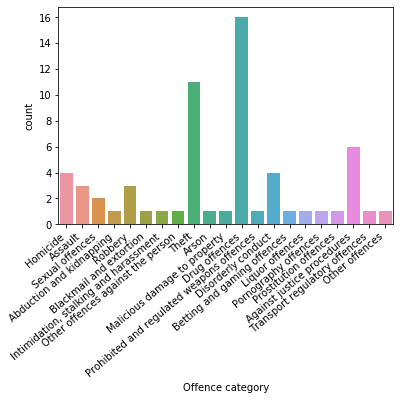


```python
data.loc[:,'Offence category'].value_counts(dropna=False)
```


    Drug offences                                16
    Theft                                        11
    Against justice procedures                    6
    Homicide                                      4
    Disorderly conduct                            4
    Assault                                       3
    Robbery                                       3
    Sexual offences                               2
    Intimidation, stalking and harassment         1
    Pornography offences                          1
    Transport regulatory offences                 1
    Other offences against the person             1
    Prohibited and regulated weapons offences     1
    Arson                                         1
    Liquor offences                               1
    Other offences                                1
    Betting and gaming offences                   1
    Blackmail and extortion                       1
    Prostitution offences                         1
    Abduction and kidnapping                      1
    Malicious damage to property                  1
    Name: Offence category, dtype: int64


```python
data.loc[:,'Subcategory'].value_counts(dropna =False)
```


    NaN                                                             13
    Break and enter dwelling                                         1
    Possession and/or use of ecstasy                                 1
    Indecent assault, act of indecency and other sexual offences     1
    Offensive conduct                                                1
    Dealing, trafficking in amphetamines                             1
    Dealing, trafficking in ecstasy                                  1
    Possession and/or use of amphetamines                            1
    Attempted murder                                                 1
    Dealing, trafficking in narcotics                                1
    Other offences against justice procedures                        1
    Other drug offences                                              1
    Dealing, trafficking in cocaine                                  1
    Importing drugs                                                  1
    Stock theft                                                      1
    Possession and/or use of other drugs                             1
    Steal from retail store                                          1
    Manufacture drug                                                 1
    Offensive language                                               1
    Breach bail conditions                                           1
    Robbery with a firearm                                           1
    Criminal intent                                                  1
    Non-domestic violence related assault                            1
    Breach Apprehended Violence Order                                1
    Motor vehicle theft                                              1
    Other theft                                                      1
    Receiving or handling stolen goods                               1
    Steal from motor vehicle                                         1
    Sexual assault                                                   1
    Steal from dwelling                                              1
    Break and enter non-dwelling                                     1
    Possession and/or use of cannabis                                1
    Domestic violence related assault                                1
    Possession and/or use of cocaine                                 1
    Manslaughter *                                                   1
    Steal from person                                                1
    Murder accessory, conspiracy                                     1
    Possession and/or use of narcotics                               1
    Murder *                                                         1
    Trespass                                                         1
    Fail to appear                                                   1
    Cultivating cannabis                                             1
    Resist or hinder officer                                         1
    Robbery with a weapon not a firearm                              1
    Escape custody                                                   1
    Fraud                                                            1
    Assault Police                                                   1
    Robbery without a weapon                                         1
    Dealing, trafficking in cannabis                                 1
    Dealing, trafficking in other drugs                              1
    Name: Subcategory, dtype: int64


'Subcategory' has 13 missing values. Lets look at them


```python
print(data)
```


<div>
<table border="1" class="dataframe">
  <thead>
    <tr style="text-align: right;">
      <th></th>
      <th>State</th>
      <th>Offence category</th>
      <th>Subcategory</th>
      <th>2019 population</th>
      <th>2020 population</th>
      <th>Jan 1995</th>
      <th>Feb 1995</th>
      <th>Mar 1995</th>
      <th>Apr 1995</th>
      <th>May 1995</th>
      <th>...</th>
      <th>Nov 2019</th>
      <th>Dec 2019</th>
      <th>Jan 2020</th>
      <th>Feb 2020</th>
      <th>Mar 2020</th>
      <th>Total for prev 12m</th>
      <th>Total for last 12m</th>
      <th>% change</th>
      <th>Kendall's trend test over 24m</th>
      <th>p-value for Kendall's trend test</th>
    </tr>
  </thead>
  <tbody>
    <tr>
      <th>0</th>
      <td>NSW</td>
      <td>Homicide</td>
      <td>Murder *</td>
      <td>7,988,241</td>
      <td>7,988,241</td>
      <td>9</td>
      <td>11</td>
      <td>10</td>
      <td>11</td>
      <td>7</td>
      <td>...</td>
      <td>8</td>
      <td>8</td>
      <td>8</td>
      <td>7</td>
      <td>6</td>
      <td>76</td>
      <td>74</td>
      <td>-2.6%</td>
      <td>0.13</td>
      <td>0.41</td>
    </tr>
    <tr>
      <th>1</th>
      <td>NSW</td>
      <td>Homicide</td>
      <td>Attempted murder</td>
      <td>7,988,241</td>
      <td>7,988,241</td>
      <td>1</td>
      <td>3</td>
      <td>4</td>
      <td>6</td>
      <td>5</td>
      <td>...</td>
      <td>4</td>
      <td>2</td>
      <td>4</td>
      <td>2</td>
      <td>2</td>
      <td>20</td>
      <td>29</td>
      <td>45.0%</td>
      <td>0.21</td>
      <td>0.18</td>
    </tr>
    <tr>
      <th>2</th>
      <td>NSW</td>
      <td>Homicide</td>
      <td>Murder accessory, conspiracy</td>
      <td>7,988,241</td>
      <td>7,988,241</td>
      <td>0</td>
      <td>2</td>
      <td>0</td>
      <td>0</td>
      <td>2</td>
      <td>...</td>
      <td>0</td>
      <td>0</td>
      <td>1</td>
      <td>0</td>
      <td>1</td>
      <td>2</td>
      <td>2</td>
      <td>0.0%</td>
      <td>0.15</td>
      <td>0.39</td>
    </tr>
    <tr>
      <th>3</th>
      <td>NSW</td>
      <td>Homicide</td>
      <td>Manslaughter *</td>
      <td>7,988,241</td>
      <td>7,988,241</td>
      <td>0</td>
      <td>2</td>
      <td>1</td>
      <td>2</td>
      <td>1</td>
      <td>...</td>
      <td>0</td>
      <td>1</td>
      <td>0</td>
      <td>1</td>
      <td>1</td>
      <td>12</td>
      <td>7</td>
      <td>-41.7%</td>
      <td>-0.08</td>
      <td>0.61</td>
    </tr>
    <tr>
      <th>4</th>
      <td>NSW</td>
      <td>Assault</td>
      <td>Domestic violence related assault</td>
      <td>7,988,241</td>
      <td>7,988,241</td>
      <td>613</td>
      <td>591</td>
      <td>625</td>
      <td>640</td>
      <td>602</td>
      <td>...</td>
      <td>2772</td>
      <td>3135</td>
      <td>3128</td>
      <td>2550</td>
      <td>2757</td>
      <td>30227</td>
      <td>31457</td>
      <td>4.1%</td>
      <td>0.48</td>
      <td>0.00</td>
    </tr>
    <tr>
      <th>...</th>
      <td>...</td>
      <td>...</td>
      <td>...</td>
      <td>...</td>
      <td>...</td>
      <td>...</td>
      <td>...</td>
      <td>...</td>
      <td>...</td>
      <td>...</td>
      <td>...</td>
      <td>...</td>
      <td>...</td>
      <td>...</td>
      <td>...</td>
      <td>...</td>
      <td>...</td>
      <td>...</td>
      <td>...</td>
      <td>...</td>
      <td>...</td>
    </tr>
    <tr>
      <th>57</th>
      <td>NSW</td>
      <td>Against justice procedures</td>
      <td>Fail to appear</td>
      <td>7,988,241</td>
      <td>7,988,241</td>
      <td>141</td>
      <td>143</td>
      <td>135</td>
      <td>121</td>
      <td>158</td>
      <td>...</td>
      <td>55</td>
      <td>71</td>
      <td>86</td>
      <td>71</td>
      <td>66</td>
      <td>509</td>
      <td>674</td>
      <td>32.4%</td>
      <td>0.39</td>
      <td>0.01</td>
    </tr>
    <tr>
      <th>58</th>
      <td>NSW</td>
      <td>Against justice procedures</td>
      <td>Resist or hinder officer</td>
      <td>7,988,241</td>
      <td>7,988,241</td>
      <td>397</td>
      <td>347</td>
      <td>338</td>
      <td>322</td>
      <td>289</td>
      <td>...</td>
      <td>521</td>
      <td>616</td>
      <td>570</td>
      <td>497</td>
      <td>507</td>
      <td>6082</td>
      <td>5987</td>
      <td>-1.6%</td>
      <td>0.15</td>
      <td>0.31</td>
    </tr>
    <tr>
      <th>59</th>
      <td>NSW</td>
      <td>Against justice procedures</td>
      <td>Other offences against justice procedures</td>
      <td>7,988,241</td>
      <td>7,988,241</td>
      <td>301</td>
      <td>294</td>
      <td>387</td>
      <td>304</td>
      <td>386</td>
      <td>...</td>
      <td>150</td>
      <td>144</td>
      <td>120</td>
      <td>112</td>
      <td>138</td>
      <td>828</td>
      <td>1703</td>
      <td>105.7%</td>
      <td>0.49</td>
      <td>0.00</td>
    </tr>
    <tr>
      <th>60</th>
      <td>NSW</td>
      <td>Transport regulatory offences</td>
      <td>NaN</td>
      <td>7,988,241</td>
      <td>7,988,241</td>
      <td>40</td>
      <td>57</td>
      <td>57</td>
      <td>53</td>
      <td>86</td>
      <td>...</td>
      <td>9931</td>
      <td>9543</td>
      <td>8860</td>
      <td>8242</td>
      <td>7114</td>
      <td>112907</td>
      <td>110111</td>
      <td>-2.5%</td>
      <td>-0.18</td>
      <td>0.21</td>
    </tr>
    <tr>
      <th>61</th>
      <td>NSW</td>
      <td>Other offences</td>
      <td>NaN</td>
      <td>7,988,241</td>
      <td>7,988,241</td>
      <td>596</td>
      <td>516</td>
      <td>560</td>
      <td>492</td>
      <td>616</td>
      <td>...</td>
      <td>1229</td>
      <td>1379</td>
      <td>1317</td>
      <td>943</td>
      <td>1832</td>
      <td>14873</td>
      <td>14674</td>
      <td>-1.3%</td>
      <td>0.09</td>
      <td>0.52</td>
    </tr>
  </tbody>
</table>
<p>62 rows × 313 columns</p>
</div>


```python
data[data['Subcategory'].isna()]
```


<div>
<table border="1" class="dataframe">
  <thead>
    <tr style="text-align: right;">
      <th></th>
      <th>State</th>
      <th>Offence category</th>
      <th>Subcategory</th>
      <th>2019 population</th>
      <th>2020 population</th>
      <th>Jan 1995</th>
      <th>Feb 1995</th>
      <th>Mar 1995</th>
      <th>Apr 1995</th>
      <th>May 1995</th>
      <th>...</th>
      <th>Nov 2019</th>
      <th>Dec 2019</th>
      <th>Jan 2020</th>
      <th>Feb 2020</th>
      <th>Mar 2020</th>
      <th>Total for prev 12m</th>
      <th>Total for last 12m</th>
      <th>% change</th>
      <th>Kendall's trend test over 24m</th>
      <th>p-value for Kendall's trend test</th>
    </tr>
  </thead>
  <tbody>
    <tr>
      <th>9</th>
      <td>NSW</td>
      <td>Abduction and kidnapping</td>
      <td>NaN</td>
      <td>7,988,241</td>
      <td>7,988,241</td>
      <td>15</td>
      <td>16</td>
      <td>23</td>
      <td>22</td>
      <td>14</td>
      <td>...</td>
      <td>28</td>
      <td>17</td>
      <td>19</td>
      <td>12</td>
      <td>9</td>
      <td>206</td>
      <td>197</td>
      <td>-4.4%</td>
      <td>-0.05</td>
      <td>0.73</td>
    </tr>
    <tr>
      <th>13</th>
      <td>NSW</td>
      <td>Blackmail and extortion</td>
      <td>NaN</td>
      <td>7,988,241</td>
      <td>7,988,241</td>
      <td>1</td>
      <td>2</td>
      <td>2</td>
      <td>1</td>
      <td>3</td>
      <td>...</td>
      <td>9</td>
      <td>4</td>
      <td>9</td>
      <td>9</td>
      <td>5</td>
      <td>111</td>
      <td>82</td>
      <td>-26.1%</td>
      <td>-0.34</td>
      <td>0.03</td>
    </tr>
    <tr>
      <th>14</th>
      <td>NSW</td>
      <td>Intimidation, stalking and harassment</td>
      <td>NaN</td>
      <td>7,988,241</td>
      <td>7,988,241</td>
      <td>346</td>
      <td>331</td>
      <td>433</td>
      <td>416</td>
      <td>476</td>
      <td>...</td>
      <td>3230</td>
      <td>3126</td>
      <td>3263</td>
      <td>3164</td>
      <td>3112</td>
      <td>32579</td>
      <td>36059</td>
      <td>10.7%</td>
      <td>0.70</td>
      <td>0.00</td>
    </tr>
    <tr>
      <th>15</th>
      <td>NSW</td>
      <td>Other offences against the person</td>
      <td>NaN</td>
      <td>7,988,241</td>
      <td>7,988,241</td>
      <td>96</td>
      <td>69</td>
      <td>81</td>
      <td>84</td>
      <td>72</td>
      <td>...</td>
      <td>104</td>
      <td>104</td>
      <td>95</td>
      <td>87</td>
      <td>105</td>
      <td>1118</td>
      <td>1200</td>
      <td>7.3%</td>
      <td>0.25</td>
      <td>0.09</td>
    </tr>
    <tr>
      <th>27</th>
      <td>NSW</td>
      <td>Arson</td>
      <td>NaN</td>
      <td>7,988,241</td>
      <td>7,988,241</td>
      <td>268</td>
      <td>198</td>
      <td>209</td>
      <td>252</td>
      <td>231</td>
      <td>...</td>
      <td>502</td>
      <td>479</td>
      <td>310</td>
      <td>263</td>
      <td>336</td>
      <td>5124</td>
      <td>4922</td>
      <td>-3.9%</td>
      <td>-0.11</td>
      <td>0.44</td>
    </tr>
    <tr>
      <th>28</th>
      <td>NSW</td>
      <td>Malicious damage to property</td>
      <td>NaN</td>
      <td>7,988,241</td>
      <td>7,988,241</td>
      <td>6183</td>
      <td>5352</td>
      <td>5755</td>
      <td>5531</td>
      <td>5742</td>
      <td>...</td>
      <td>5052</td>
      <td>5085</td>
      <td>4894</td>
      <td>4278</td>
      <td>4527</td>
      <td>58163</td>
      <td>56060</td>
      <td>-3.6%</td>
      <td>-0.01</td>
      <td>0.92</td>
    </tr>
    <tr>
      <th>45</th>
      <td>NSW</td>
      <td>Prohibited and regulated weapons offences</td>
      <td>NaN</td>
      <td>7,988,241</td>
      <td>7,988,241</td>
      <td>276</td>
      <td>283</td>
      <td>329</td>
      <td>357</td>
      <td>300</td>
      <td>...</td>
      <td>1372</td>
      <td>1289</td>
      <td>1426</td>
      <td>1248</td>
      <td>1379</td>
      <td>14683</td>
      <td>16420</td>
      <td>11.8%</td>
      <td>0.39</td>
      <td>0.01</td>
    </tr>
    <tr>
      <th>50</th>
      <td>NSW</td>
      <td>Betting and gaming offences</td>
      <td>NaN</td>
      <td>7,988,241</td>
      <td>7,988,241</td>
      <td>3</td>
      <td>3</td>
      <td>6</td>
      <td>8</td>
      <td>4</td>
      <td>...</td>
      <td>6</td>
      <td>9</td>
      <td>9</td>
      <td>4</td>
      <td>4</td>
      <td>184</td>
      <td>84</td>
      <td>-54.3%</td>
      <td>-0.26</td>
      <td>0.08</td>
    </tr>
    <tr>
      <th>51</th>
      <td>NSW</td>
      <td>Liquor offences</td>
      <td>NaN</td>
      <td>7,988,241</td>
      <td>7,988,241</td>
      <td>67</td>
      <td>72</td>
      <td>99</td>
      <td>101</td>
      <td>87</td>
      <td>...</td>
      <td>995</td>
      <td>1193</td>
      <td>929</td>
      <td>776</td>
      <td>647</td>
      <td>11502</td>
      <td>11120</td>
      <td>-3.3%</td>
      <td>-0.09</td>
      <td>0.52</td>
    </tr>
    <tr>
      <th>52</th>
      <td>NSW</td>
      <td>Pornography offences</td>
      <td>NaN</td>
      <td>7,988,241</td>
      <td>7,988,241</td>
      <td>2</td>
      <td>3</td>
      <td>4</td>
      <td>1</td>
      <td>3</td>
      <td>...</td>
      <td>64</td>
      <td>42</td>
      <td>31</td>
      <td>58</td>
      <td>62</td>
      <td>656</td>
      <td>671</td>
      <td>2.3%</td>
      <td>0.03</td>
      <td>0.82</td>
    </tr>
    <tr>
      <th>53</th>
      <td>NSW</td>
      <td>Prostitution offences</td>
      <td>NaN</td>
      <td>7,988,241</td>
      <td>7,988,241</td>
      <td>49</td>
      <td>17</td>
      <td>35</td>
      <td>52</td>
      <td>35</td>
      <td>...</td>
      <td>3</td>
      <td>0</td>
      <td>2</td>
      <td>3</td>
      <td>4</td>
      <td>24</td>
      <td>24</td>
      <td>0.0%</td>
      <td>0.08</td>
      <td>0.61</td>
    </tr>
    <tr>
      <th>60</th>
      <td>NSW</td>
      <td>Transport regulatory offences</td>
      <td>NaN</td>
      <td>7,988,241</td>
      <td>7,988,241</td>
      <td>40</td>
      <td>57</td>
      <td>57</td>
      <td>53</td>
      <td>86</td>
      <td>...</td>
      <td>9931</td>
      <td>9543</td>
      <td>8860</td>
      <td>8242</td>
      <td>7114</td>
      <td>112907</td>
      <td>110111</td>
      <td>-2.5%</td>
      <td>-0.18</td>
      <td>0.21</td>
    </tr>
    <tr>
      <th>61</th>
      <td>NSW</td>
      <td>Other offences</td>
      <td>NaN</td>
      <td>7,988,241</td>
      <td>7,988,241</td>
      <td>596</td>
      <td>516</td>
      <td>560</td>
      <td>492</td>
      <td>616</td>
      <td>...</td>
      <td>1229</td>
      <td>1379</td>
      <td>1317</td>
      <td>943</td>
      <td>1832</td>
      <td>14873</td>
      <td>14674</td>
      <td>-1.3%</td>
      <td>0.09</td>
      <td>0.52</td>
    </tr>
  </tbody>
</table>
<p>13 rows × 313 columns</p>
</div>


If there is no subcategory, the value should be taken from 'Offence category'


```python
data.Subcategory.fillna(data['Offence category'], inplace=True)
```


```python
print(data)
```


<div>
<table border="1" class="dataframe">
  <thead>
    <tr style="text-align: right;">
      <th></th>
      <th>State</th>
      <th>Offence category</th>
      <th>Subcategory</th>
      <th>2019 population</th>
      <th>2020 population</th>
      <th>Jan 1995</th>
      <th>Feb 1995</th>
      <th>Mar 1995</th>
      <th>Apr 1995</th>
      <th>May 1995</th>
      <th>...</th>
      <th>Nov 2019</th>
      <th>Dec 2019</th>
      <th>Jan 2020</th>
      <th>Feb 2020</th>
      <th>Mar 2020</th>
      <th>Total for prev 12m</th>
      <th>Total for last 12m</th>
      <th>% change</th>
      <th>Kendall's trend test over 24m</th>
      <th>p-value for Kendall's trend test</th>
    </tr>
  </thead>
  <tbody>
    <tr>
      <th>0</th>
      <td>NSW</td>
      <td>Homicide</td>
      <td>Murder *</td>
      <td>7,988,241</td>
      <td>7,988,241</td>
      <td>9</td>
      <td>11</td>
      <td>10</td>
      <td>11</td>
      <td>7</td>
      <td>...</td>
      <td>8</td>
      <td>8</td>
      <td>8</td>
      <td>7</td>
      <td>6</td>
      <td>76</td>
      <td>74</td>
      <td>-2.6%</td>
      <td>0.13</td>
      <td>0.41</td>
    </tr>
    <tr>
      <th>1</th>
      <td>NSW</td>
      <td>Homicide</td>
      <td>Attempted murder</td>
      <td>7,988,241</td>
      <td>7,988,241</td>
      <td>1</td>
      <td>3</td>
      <td>4</td>
      <td>6</td>
      <td>5</td>
      <td>...</td>
      <td>4</td>
      <td>2</td>
      <td>4</td>
      <td>2</td>
      <td>2</td>
      <td>20</td>
      <td>29</td>
      <td>45.0%</td>
      <td>0.21</td>
      <td>0.18</td>
    </tr>
    <tr>
      <th>2</th>
      <td>NSW</td>
      <td>Homicide</td>
      <td>Murder accessory, conspiracy</td>
      <td>7,988,241</td>
      <td>7,988,241</td>
      <td>0</td>
      <td>2</td>
      <td>0</td>
      <td>0</td>
      <td>2</td>
      <td>...</td>
      <td>0</td>
      <td>0</td>
      <td>1</td>
      <td>0</td>
      <td>1</td>
      <td>2</td>
      <td>2</td>
      <td>0.0%</td>
      <td>0.15</td>
      <td>0.39</td>
    </tr>
    <tr>
      <th>3</th>
      <td>NSW</td>
      <td>Homicide</td>
      <td>Manslaughter *</td>
      <td>7,988,241</td>
      <td>7,988,241</td>
      <td>0</td>
      <td>2</td>
      <td>1</td>
      <td>2</td>
      <td>1</td>
      <td>...</td>
      <td>0</td>
      <td>1</td>
      <td>0</td>
      <td>1</td>
      <td>1</td>
      <td>12</td>
      <td>7</td>
      <td>-41.7%</td>
      <td>-0.08</td>
      <td>0.61</td>
    </tr>
    <tr>
      <th>4</th>
      <td>NSW</td>
      <td>Assault</td>
      <td>Domestic violence related assault</td>
      <td>7,988,241</td>
      <td>7,988,241</td>
      <td>613</td>
      <td>591</td>
      <td>625</td>
      <td>640</td>
      <td>602</td>
      <td>...</td>
      <td>2772</td>
      <td>3135</td>
      <td>3128</td>
      <td>2550</td>
      <td>2757</td>
      <td>30227</td>
      <td>31457</td>
      <td>4.1%</td>
      <td>0.48</td>
      <td>0.00</td>
    </tr>
    <tr>
      <th>...</th>
      <td>...</td>
      <td>...</td>
      <td>...</td>
      <td>...</td>
      <td>...</td>
      <td>...</td>
      <td>...</td>
      <td>...</td>
      <td>...</td>
      <td>...</td>
      <td>...</td>
      <td>...</td>
      <td>...</td>
      <td>...</td>
      <td>...</td>
      <td>...</td>
      <td>...</td>
      <td>...</td>
      <td>...</td>
      <td>...</td>
      <td>...</td>
    </tr>
    <tr>
      <th>57</th>
      <td>NSW</td>
      <td>Against justice procedures</td>
      <td>Fail to appear</td>
      <td>7,988,241</td>
      <td>7,988,241</td>
      <td>141</td>
      <td>143</td>
      <td>135</td>
      <td>121</td>
      <td>158</td>
      <td>...</td>
      <td>55</td>
      <td>71</td>
      <td>86</td>
      <td>71</td>
      <td>66</td>
      <td>509</td>
      <td>674</td>
      <td>32.4%</td>
      <td>0.39</td>
      <td>0.01</td>
    </tr>
    <tr>
      <th>58</th>
      <td>NSW</td>
      <td>Against justice procedures</td>
      <td>Resist or hinder officer</td>
      <td>7,988,241</td>
      <td>7,988,241</td>
      <td>397</td>
      <td>347</td>
      <td>338</td>
      <td>322</td>
      <td>289</td>
      <td>...</td>
      <td>521</td>
      <td>616</td>
      <td>570</td>
      <td>497</td>
      <td>507</td>
      <td>6082</td>
      <td>5987</td>
      <td>-1.6%</td>
      <td>0.15</td>
      <td>0.31</td>
    </tr>
    <tr>
      <th>59</th>
      <td>NSW</td>
      <td>Against justice procedures</td>
      <td>Other offences against justice procedures</td>
      <td>7,988,241</td>
      <td>7,988,241</td>
      <td>301</td>
      <td>294</td>
      <td>387</td>
      <td>304</td>
      <td>386</td>
      <td>...</td>
      <td>150</td>
      <td>144</td>
      <td>120</td>
      <td>112</td>
      <td>138</td>
      <td>828</td>
      <td>1703</td>
      <td>105.7%</td>
      <td>0.49</td>
      <td>0.00</td>
    </tr>
    <tr>
      <th>60</th>
      <td>NSW</td>
      <td>Transport regulatory offences</td>
      <td>Transport regulatory offences</td>
      <td>7,988,241</td>
      <td>7,988,241</td>
      <td>40</td>
      <td>57</td>
      <td>57</td>
      <td>53</td>
      <td>86</td>
      <td>...</td>
      <td>9931</td>
      <td>9543</td>
      <td>8860</td>
      <td>8242</td>
      <td>7114</td>
      <td>112907</td>
      <td>110111</td>
      <td>-2.5%</td>
      <td>-0.18</td>
      <td>0.21</td>
    </tr>
    <tr>
      <th>61</th>
      <td>NSW</td>
      <td>Other offences</td>
      <td>Other offences</td>
      <td>7,988,241</td>
      <td>7,988,241</td>
      <td>596</td>
      <td>516</td>
      <td>560</td>
      <td>492</td>
      <td>616</td>
      <td>...</td>
      <td>1229</td>
      <td>1379</td>
      <td>1317</td>
      <td>943</td>
      <td>1832</td>
      <td>14873</td>
      <td>14674</td>
      <td>-1.3%</td>
      <td>0.09</td>
      <td>0.52</td>
    </tr>
  </tbody>
</table>
<p>62 rows × 313 columns</p>
</div>


```python
data.Subcategory.replace("Murder *", "Murder", inplace=True)
data.Subcategory.replace("Manslaughter *", "Manslaughter", inplace=True)
data.head()
```


<div>
<table border="1" class="dataframe">
  <thead>
    <tr style="text-align: right;">
      <th></th>
      <th>State</th>
      <th>Offence category</th>
      <th>Subcategory</th>
      <th>2019 population</th>
      <th>2020 population</th>
      <th>Jan 1995</th>
      <th>Feb 1995</th>
      <th>Mar 1995</th>
      <th>Apr 1995</th>
      <th>May 1995</th>
      <th>...</th>
      <th>Nov 2019</th>
      <th>Dec 2019</th>
      <th>Jan 2020</th>
      <th>Feb 2020</th>
      <th>Mar 2020</th>
      <th>Total for prev 12m</th>
      <th>Total for last 12m</th>
      <th>% change</th>
      <th>Kendall's trend test over 24m</th>
      <th>p-value for Kendall's trend test</th>
    </tr>
  </thead>
  <tbody>
    <tr>
      <th>0</th>
      <td>NSW</td>
      <td>Homicide</td>
      <td>Murder</td>
      <td>7,988,241</td>
      <td>7,988,241</td>
      <td>9</td>
      <td>11</td>
      <td>10</td>
      <td>11</td>
      <td>7</td>
      <td>...</td>
      <td>8</td>
      <td>8</td>
      <td>8</td>
      <td>7</td>
      <td>6</td>
      <td>76</td>
      <td>74</td>
      <td>-2.6%</td>
      <td>0.13</td>
      <td>0.41</td>
    </tr>
    <tr>
      <th>1</th>
      <td>NSW</td>
      <td>Homicide</td>
      <td>Attempted murder</td>
      <td>7,988,241</td>
      <td>7,988,241</td>
      <td>1</td>
      <td>3</td>
      <td>4</td>
      <td>6</td>
      <td>5</td>
      <td>...</td>
      <td>4</td>
      <td>2</td>
      <td>4</td>
      <td>2</td>
      <td>2</td>
      <td>20</td>
      <td>29</td>
      <td>45.0%</td>
      <td>0.21</td>
      <td>0.18</td>
    </tr>
    <tr>
      <th>2</th>
      <td>NSW</td>
      <td>Homicide</td>
      <td>Murder accessory, conspiracy</td>
      <td>7,988,241</td>
      <td>7,988,241</td>
      <td>0</td>
      <td>2</td>
      <td>0</td>
      <td>0</td>
      <td>2</td>
      <td>...</td>
      <td>0</td>
      <td>0</td>
      <td>1</td>
      <td>0</td>
      <td>1</td>
      <td>2</td>
      <td>2</td>
      <td>0.0%</td>
      <td>0.15</td>
      <td>0.39</td>
    </tr>
    <tr>
      <th>3</th>
      <td>NSW</td>
      <td>Homicide</td>
      <td>Manslaughter</td>
      <td>7,988,241</td>
      <td>7,988,241</td>
      <td>0</td>
      <td>2</td>
      <td>1</td>
      <td>2</td>
      <td>1</td>
      <td>...</td>
      <td>0</td>
      <td>1</td>
      <td>0</td>
      <td>1</td>
      <td>1</td>
      <td>12</td>
      <td>7</td>
      <td>-41.7%</td>
      <td>-0.08</td>
      <td>0.61</td>
    </tr>
    <tr>
      <th>4</th>
      <td>NSW</td>
      <td>Assault</td>
      <td>Domestic violence related assault</td>
      <td>7,988,241</td>
      <td>7,988,241</td>
      <td>613</td>
      <td>591</td>
      <td>625</td>
      <td>640</td>
      <td>602</td>
      <td>...</td>
      <td>2772</td>
      <td>3135</td>
      <td>3128</td>
      <td>2550</td>
      <td>2757</td>
      <td>30227</td>
      <td>31457</td>
      <td>4.1%</td>
      <td>0.48</td>
      <td>0.00</td>
    </tr>
  </tbody>
</table>
<p>5 rows × 313 columns</p>
</div>


We can see that the first 5 columns (except 'Subcategory') and the last 5 columns are not necessary. We can disgard them.


```python
data.drop(data.iloc[:, 0:2], inplace=True, axis=1) #drop the 1st and the 2nd columns
```


```python
data.drop(data.iloc[:, 1:3], inplace=True, axis=1) #drop third to 5th columns
```


```python
data.drop(data.iloc[:, -5:], inplace=True, axis=1) #drop the last 5 columns
```


```python
data.head()
```


<div>
<table border="1" class="dataframe">
  <thead>
    <tr style="text-align: right;">
      <th></th>
      <th>Subcategory</th>
      <th>Jan 1995</th>
      <th>Feb 1995</th>
      <th>Mar 1995</th>
      <th>Apr 1995</th>
      <th>May 1995</th>
      <th>Jun 1995</th>
      <th>Jul 1995</th>
      <th>Aug 1995</th>
      <th>Sep 1995</th>
      <th>...</th>
      <th>Jun 2019</th>
      <th>Jul 2019</th>
      <th>Aug 2019</th>
      <th>Sep 2019</th>
      <th>Oct 2019</th>
      <th>Nov 2019</th>
      <th>Dec 2019</th>
      <th>Jan 2020</th>
      <th>Feb 2020</th>
      <th>Mar 2020</th>
    </tr>
  </thead>
  <tbody>
    <tr>
      <th>0</th>
      <td>Murder</td>
      <td>9</td>
      <td>11</td>
      <td>10</td>
      <td>11</td>
      <td>7</td>
      <td>10</td>
      <td>8</td>
      <td>15</td>
      <td>10</td>
      <td>...</td>
      <td>4</td>
      <td>2</td>
      <td>9</td>
      <td>5</td>
      <td>6</td>
      <td>8</td>
      <td>8</td>
      <td>8</td>
      <td>7</td>
      <td>6</td>
    </tr>
    <tr>
      <th>1</th>
      <td>Attempted murder</td>
      <td>1</td>
      <td>3</td>
      <td>4</td>
      <td>6</td>
      <td>5</td>
      <td>1</td>
      <td>5</td>
      <td>1</td>
      <td>6</td>
      <td>...</td>
      <td>2</td>
      <td>5</td>
      <td>0</td>
      <td>2</td>
      <td>2</td>
      <td>4</td>
      <td>2</td>
      <td>4</td>
      <td>2</td>
      <td>2</td>
    </tr>
    <tr>
      <th>2</th>
      <td>Murder accessory, conspiracy</td>
      <td>0</td>
      <td>2</td>
      <td>0</td>
      <td>0</td>
      <td>2</td>
      <td>0</td>
      <td>0</td>
      <td>1</td>
      <td>0</td>
      <td>...</td>
      <td>0</td>
      <td>0</td>
      <td>0</td>
      <td>0</td>
      <td>0</td>
      <td>0</td>
      <td>0</td>
      <td>1</td>
      <td>0</td>
      <td>1</td>
    </tr>
    <tr>
      <th>3</th>
      <td>Manslaughter</td>
      <td>0</td>
      <td>2</td>
      <td>1</td>
      <td>2</td>
      <td>1</td>
      <td>0</td>
      <td>1</td>
      <td>0</td>
      <td>1</td>
      <td>...</td>
      <td>1</td>
      <td>0</td>
      <td>0</td>
      <td>3</td>
      <td>0</td>
      <td>0</td>
      <td>1</td>
      <td>0</td>
      <td>1</td>
      <td>1</td>
    </tr>
    <tr>
      <th>4</th>
      <td>Domestic violence related assault</td>
      <td>613</td>
      <td>591</td>
      <td>625</td>
      <td>640</td>
      <td>602</td>
      <td>608</td>
      <td>639</td>
      <td>741</td>
      <td>714</td>
      <td>...</td>
      <td>2347</td>
      <td>2359</td>
      <td>2495</td>
      <td>2525</td>
      <td>2661</td>
      <td>2772</td>
      <td>3135</td>
      <td>3128</td>
      <td>2550</td>
      <td>2757</td>
    </tr>
  </tbody>
</table>
<p>5 rows × 304 columns</p>
</div>


Let's remove the column name 'Subcategory' because we want to convert it into an index.


```python
data.rename(columns={"Subcategory": ""}, inplace=True)
```


```python
data.head()
```


<div>
<table border="1" class="dataframe">
  <thead>
    <tr style="text-align: right;">
      <th></th>
      <th></th>
      <th>Jan 1995</th>
      <th>Feb 1995</th>
      <th>Mar 1995</th>
      <th>Apr 1995</th>
      <th>May 1995</th>
      <th>Jun 1995</th>
      <th>Jul 1995</th>
      <th>Aug 1995</th>
      <th>Sep 1995</th>
      <th>...</th>
      <th>Jun 2019</th>
      <th>Jul 2019</th>
      <th>Aug 2019</th>
      <th>Sep 2019</th>
      <th>Oct 2019</th>
      <th>Nov 2019</th>
      <th>Dec 2019</th>
      <th>Jan 2020</th>
      <th>Feb 2020</th>
      <th>Mar 2020</th>
    </tr>
  </thead>
  <tbody>
    <tr>
      <th>0</th>
      <td>Murder</td>
      <td>9</td>
      <td>11</td>
      <td>10</td>
      <td>11</td>
      <td>7</td>
      <td>10</td>
      <td>8</td>
      <td>15</td>
      <td>10</td>
      <td>...</td>
      <td>4</td>
      <td>2</td>
      <td>9</td>
      <td>5</td>
      <td>6</td>
      <td>8</td>
      <td>8</td>
      <td>8</td>
      <td>7</td>
      <td>6</td>
    </tr>
    <tr>
      <th>1</th>
      <td>Attempted murder</td>
      <td>1</td>
      <td>3</td>
      <td>4</td>
      <td>6</td>
      <td>5</td>
      <td>1</td>
      <td>5</td>
      <td>1</td>
      <td>6</td>
      <td>...</td>
      <td>2</td>
      <td>5</td>
      <td>0</td>
      <td>2</td>
      <td>2</td>
      <td>4</td>
      <td>2</td>
      <td>4</td>
      <td>2</td>
      <td>2</td>
    </tr>
    <tr>
      <th>2</th>
      <td>Murder accessory, conspiracy</td>
      <td>0</td>
      <td>2</td>
      <td>0</td>
      <td>0</td>
      <td>2</td>
      <td>0</td>
      <td>0</td>
      <td>1</td>
      <td>0</td>
      <td>...</td>
      <td>0</td>
      <td>0</td>
      <td>0</td>
      <td>0</td>
      <td>0</td>
      <td>0</td>
      <td>0</td>
      <td>1</td>
      <td>0</td>
      <td>1</td>
    </tr>
    <tr>
      <th>3</th>
      <td>Manslaughter</td>
      <td>0</td>
      <td>2</td>
      <td>1</td>
      <td>2</td>
      <td>1</td>
      <td>0</td>
      <td>1</td>
      <td>0</td>
      <td>1</td>
      <td>...</td>
      <td>1</td>
      <td>0</td>
      <td>0</td>
      <td>3</td>
      <td>0</td>
      <td>0</td>
      <td>1</td>
      <td>0</td>
      <td>1</td>
      <td>1</td>
    </tr>
    <tr>
      <th>4</th>
      <td>Domestic violence related assault</td>
      <td>613</td>
      <td>591</td>
      <td>625</td>
      <td>640</td>
      <td>602</td>
      <td>608</td>
      <td>639</td>
      <td>741</td>
      <td>714</td>
      <td>...</td>
      <td>2347</td>
      <td>2359</td>
      <td>2495</td>
      <td>2525</td>
      <td>2661</td>
      <td>2772</td>
      <td>3135</td>
      <td>3128</td>
      <td>2550</td>
      <td>2757</td>
    </tr>
  </tbody>
</table>
<p>5 rows × 304 columns</p>
</div>


```python
data.set_index('',inplace=True)
```


```python
data.head()
```


<div>
<table border="1" class="dataframe">
  <thead>
    <tr style="text-align: right;">
      <th></th>
      <th>Jan 1995</th>
      <th>Feb 1995</th>
      <th>Mar 1995</th>
      <th>Apr 1995</th>
      <th>May 1995</th>
      <th>Jun 1995</th>
      <th>Jul 1995</th>
      <th>Aug 1995</th>
      <th>Sep 1995</th>
      <th>Oct 1995</th>
      <th>...</th>
      <th>Jun 2019</th>
      <th>Jul 2019</th>
      <th>Aug 2019</th>
      <th>Sep 2019</th>
      <th>Oct 2019</th>
      <th>Nov 2019</th>
      <th>Dec 2019</th>
      <th>Jan 2020</th>
      <th>Feb 2020</th>
      <th>Mar 2020</th>
    </tr>
    <tr>
      <th></th>
      <th></th>
      <th></th>
      <th></th>
      <th></th>
      <th></th>
      <th></th>
      <th></th>
      <th></th>
      <th></th>
      <th></th>
      <th></th>
      <th></th>
      <th></th>
      <th></th>
      <th></th>
      <th></th>
      <th></th>
      <th></th>
      <th></th>
      <th></th>
      <th></th>
    </tr>
  </thead>
  <tbody>
    <tr>
      <th>Murder</th>
      <td>9</td>
      <td>11</td>
      <td>10</td>
      <td>11</td>
      <td>7</td>
      <td>10</td>
      <td>8</td>
      <td>15</td>
      <td>10</td>
      <td>9</td>
      <td>...</td>
      <td>4</td>
      <td>2</td>
      <td>9</td>
      <td>5</td>
      <td>6</td>
      <td>8</td>
      <td>8</td>
      <td>8</td>
      <td>7</td>
      <td>6</td>
    </tr>
    <tr>
      <th>Attempted murder</th>
      <td>1</td>
      <td>3</td>
      <td>4</td>
      <td>6</td>
      <td>5</td>
      <td>1</td>
      <td>5</td>
      <td>1</td>
      <td>6</td>
      <td>9</td>
      <td>...</td>
      <td>2</td>
      <td>5</td>
      <td>0</td>
      <td>2</td>
      <td>2</td>
      <td>4</td>
      <td>2</td>
      <td>4</td>
      <td>2</td>
      <td>2</td>
    </tr>
    <tr>
      <th>Murder accessory, conspiracy</th>
      <td>0</td>
      <td>2</td>
      <td>0</td>
      <td>0</td>
      <td>2</td>
      <td>0</td>
      <td>0</td>
      <td>1</td>
      <td>0</td>
      <td>1</td>
      <td>...</td>
      <td>0</td>
      <td>0</td>
      <td>0</td>
      <td>0</td>
      <td>0</td>
      <td>0</td>
      <td>0</td>
      <td>1</td>
      <td>0</td>
      <td>1</td>
    </tr>
    <tr>
      <th>Manslaughter</th>
      <td>0</td>
      <td>2</td>
      <td>1</td>
      <td>2</td>
      <td>1</td>
      <td>0</td>
      <td>1</td>
      <td>0</td>
      <td>1</td>
      <td>0</td>
      <td>...</td>
      <td>1</td>
      <td>0</td>
      <td>0</td>
      <td>3</td>
      <td>0</td>
      <td>0</td>
      <td>1</td>
      <td>0</td>
      <td>1</td>
      <td>1</td>
    </tr>
    <tr>
      <th>Domestic violence related assault</th>
      <td>613</td>
      <td>591</td>
      <td>625</td>
      <td>640</td>
      <td>602</td>
      <td>608</td>
      <td>639</td>
      <td>741</td>
      <td>714</td>
      <td>830</td>
      <td>...</td>
      <td>2347</td>
      <td>2359</td>
      <td>2495</td>
      <td>2525</td>
      <td>2661</td>
      <td>2772</td>
      <td>3135</td>
      <td>3128</td>
      <td>2550</td>
      <td>2757</td>
    </tr>
  </tbody>
</table>
<p>5 rows × 303 columns</p>
</div>


# Converting into time series

Columns and rows need to be interchanged (transposed) because every row needs to be a time stamp.


```python
data = data.T #transpose dataframe
```


```python
data.head()
```


<div>
<table border="1" class="dataframe">
  <thead>
    <tr style="text-align: right;">
      <th></th>
      <th>Murder</th>
      <th>Attempted murder</th>
      <th>Murder accessory, conspiracy</th>
      <th>Manslaughter</th>
      <th>Domestic violence related assault</th>
      <th>Non-domestic violence related assault</th>
      <th>Assault Police</th>
      <th>Sexual assault</th>
      <th>Indecent assault, act of indecency and other sexual offences</th>
      <th>Abduction and kidnapping</th>
      <th>...</th>
      <th>Pornography offences</th>
      <th>Prostitution offences</th>
      <th>Escape custody</th>
      <th>Breach Apprehended Violence Order</th>
      <th>Breach bail conditions</th>
      <th>Fail to appear</th>
      <th>Resist or hinder officer</th>
      <th>Other offences against justice procedures</th>
      <th>Transport regulatory offences</th>
      <th>Other offences</th>
    </tr>
  </thead>
  <tbody>
    <tr>
      <th>Jan 1995</th>
      <td>9</td>
      <td>1</td>
      <td>0</td>
      <td>0</td>
      <td>613</td>
      <td>2416</td>
      <td>196</td>
      <td>237</td>
      <td>394</td>
      <td>15</td>
      <td>...</td>
      <td>2</td>
      <td>49</td>
      <td>36</td>
      <td>266</td>
      <td>135</td>
      <td>141</td>
      <td>397</td>
      <td>301</td>
      <td>40</td>
      <td>596</td>
    </tr>
    <tr>
      <th>Feb 1995</th>
      <td>11</td>
      <td>3</td>
      <td>2</td>
      <td>2</td>
      <td>591</td>
      <td>2277</td>
      <td>177</td>
      <td>157</td>
      <td>350</td>
      <td>16</td>
      <td>...</td>
      <td>3</td>
      <td>17</td>
      <td>29</td>
      <td>241</td>
      <td>115</td>
      <td>143</td>
      <td>347</td>
      <td>294</td>
      <td>57</td>
      <td>516</td>
    </tr>
    <tr>
      <th>Mar 1995</th>
      <td>10</td>
      <td>4</td>
      <td>0</td>
      <td>1</td>
      <td>625</td>
      <td>2379</td>
      <td>181</td>
      <td>199</td>
      <td>438</td>
      <td>23</td>
      <td>...</td>
      <td>4</td>
      <td>35</td>
      <td>34</td>
      <td>292</td>
      <td>144</td>
      <td>135</td>
      <td>338</td>
      <td>387</td>
      <td>57</td>
      <td>560</td>
    </tr>
    <tr>
      <th>Apr 1995</th>
      <td>11</td>
      <td>6</td>
      <td>0</td>
      <td>2</td>
      <td>640</td>
      <td>2160</td>
      <td>177</td>
      <td>188</td>
      <td>341</td>
      <td>22</td>
      <td>...</td>
      <td>1</td>
      <td>52</td>
      <td>24</td>
      <td>285</td>
      <td>131</td>
      <td>121</td>
      <td>322</td>
      <td>304</td>
      <td>53</td>
      <td>492</td>
    </tr>
    <tr>
      <th>May 1995</th>
      <td>7</td>
      <td>5</td>
      <td>2</td>
      <td>1</td>
      <td>602</td>
      <td>2128</td>
      <td>131</td>
      <td>148</td>
      <td>346</td>
      <td>14</td>
      <td>...</td>
      <td>3</td>
      <td>35</td>
      <td>23</td>
      <td>286</td>
      <td>139</td>
      <td>158</td>
      <td>289</td>
      <td>386</td>
      <td>86</td>
      <td>616</td>
    </tr>
  </tbody>
</table>
<p>5 rows × 62 columns</p>
</div>


The index column right now has string values which need to be converted into dates.


```python
data.index = pd.to_datetime(data.index, infer_datetime_format=True)
```

Save the dataframe for future use.


```python
data.to_csv('crimes_nsw.csv')
```

# Exploratory data analysis

Let's give a variable name.


```python
domestic = data['Domestic violence related assault']
```


```python
domestic.plot(kind = 'line', color = 'red',label = 'Domestic violence',linewidth=2,alpha = 1,grid = True,linestyle = '-')
plt.legend(loc='upper right')     
plt.xlabel('')              
plt.ylabel('Number of cases')
plt.title('Monthly plot of domestic violence in NSW')            
plt.show()
```


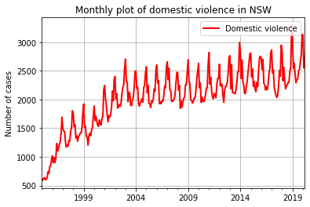


We can see in the above diagram that domestic violence in NSW follows a predictable pattern. Generally, there is an upward trend. The time series has two components: trend component and seasonal component. Let's explore more.


```python
domestic.resample('Q').mean().plot(kind = 'line', color = 'red',label = 'Domestic violence',linewidth=2,alpha = 1,grid = True,linestyle = '-')
plt.legend(loc='upper right')     
plt.xlabel('')              
plt.ylabel('Number of cases')
plt.title('Quarterly plot of domestic violence in NSW')            
plt.show()
```


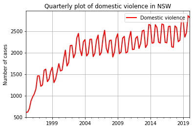


```python
yearly = domestic.resample('Y').mean().to_frame()
y = np.array(yearly[yearly.columns[0]])
x = np.array(range(len(x))) 
model = np.poly1d(np.polyfit(x, y, 1))
yearly.insert(1, "Fitted", model(x), True) 

yearly[yearly.columns[0]].plot(kind = 'line', color = 'red',label = 'Domestic violence',linewidth=2,alpha = 1,grid = True,linestyle = '-')
yearly[yearly.columns[1]].plot(kind = 'line', color = 'blue',label = 'Linear trend',linewidth=2,alpha = 1,grid = True,linestyle = '-')
plt.legend(loc='upper right')     
plt.xlabel('')              
plt.ylabel('Number of cases')
plt.title('Yearly plot of domestic violence in NSW')            
plt.show()
```


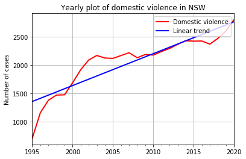


We can clearly see an upward trend on a yearly basis.


```python
yearly = domestic.to_frame()
yearly['Year'] = [d.year for d in yearly.index]
sns.set(rc={'figure.figsize':(15,8)})
sns.set(font_scale=1.2)
sns.boxplot(x='Year', y='Domestic violence related assault', data=yearly)

```


    <matplotlib.axes._subplots.AxesSubplot at 0x236df370b88>


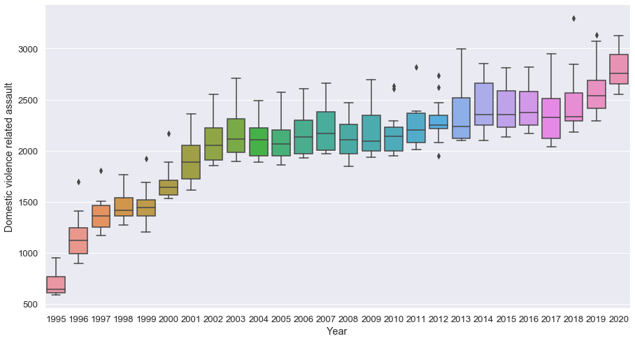


### Seasonal analysis


```python
seasonal = domestic.to_frame()
seasonal['Year'] = [d.year for d in seasonal.index]
seasonal['Month'] = [d.strftime('%b') for d in seasonal.index]
years = seasonal['Year'].unique()

```


```python
seasonal.head()
```


<div>
<style scoped>
    .dataframe tbody tr th:only-of-type {
        vertical-align: middle;
    }

    .dataframe tbody tr th {
        vertical-align: top;
    }

    .dataframe thead th {
        text-align: right;
    }
</style>
<table border="1" class="dataframe">
  <thead>
    <tr style="text-align: right;">
      <th></th>
      <th>Domestic violence related assault</th>
      <th>Year</th>
      <th>Month</th>
    </tr>
  </thead>
  <tbody>
    <tr>
      <th>1995-01-01</th>
      <td>613</td>
      <td>1995</td>
      <td>Jan</td>
    </tr>
    <tr>
      <th>1995-02-01</th>
      <td>591</td>
      <td>1995</td>
      <td>Feb</td>
    </tr>
    <tr>
      <th>1995-03-01</th>
      <td>625</td>
      <td>1995</td>
      <td>Mar</td>
    </tr>
    <tr>
      <th>1995-04-01</th>
      <td>640</td>
      <td>1995</td>
      <td>Apr</td>
    </tr>
    <tr>
      <th>1995-05-01</th>
      <td>602</td>
      <td>1995</td>
      <td>May</td>
    </tr>
  </tbody>
</table>
</div>


```python
np.random.seed(53)
colors = np.random.choice(list(mpl.colors.XKCD_COLORS.keys()), len(years), replace=False)
```


```python
for i, year in enumerate(years):
    y_data = seasonal.loc[seasonal.Year==year, :]
    y_data.set_index('Month', inplace=True, drop=True)
    y_data.drop(y_data.iloc[:, 1:2], inplace=True, axis=1)
    y_data['Domestic violence related assault'].plot(kind = 'line', color=colors[i],label = year,linewidth=2,alpha = 1,grid = True,linestyle = '-')
plt.legend(bbox_to_anchor=(1.05, 1))     
plt.xlabel('')              
plt.ylabel('Number of cases')
plt.title('Seasonal plot of domestic violence in NSW')            
plt.show()    
```


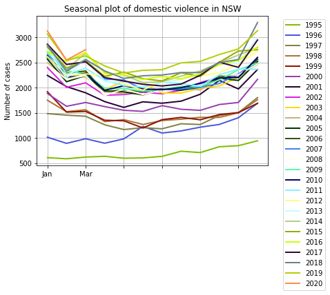


As depicted in the above figure, domenstic violence peaks in December and January each year (holiday season). This may be due to more idle time and more drinking. Case numbers also rise in March.


```python
yearly = domestic.to_frame()
yearly['Year'] = [d.year for d in yearly.index]
yearly['Month'] = [d.strftime('%b') for d in yearly.index]
sns.set(rc={'figure.figsize':(15,8)})
sns.set(font_scale=1.2)
sns.boxplot(x='Month', y='Domestic violence related assault', data=yearly.loc[~yearly.Year.isin([1995, 2020]), :])
```


    <matplotlib.axes._subplots.AxesSubplot at 0x236e26dd808>


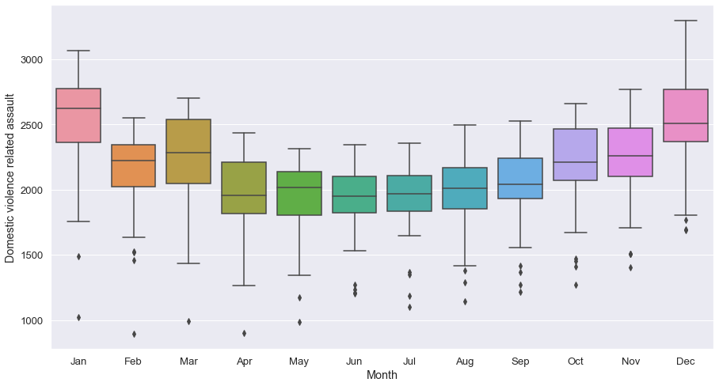


July is the month with the lowest variance, coinciding with beginnings of financial years.

# Time series forecasting

Now let's start forecasting. The time series is obviously not stationary as evident from the figure below.


```python
sns.reset_orig()
plt.rcdefaults()
domestic.plot(kind = 'line', color = 'red',label = 'Domestic violence',linewidth=2,alpha = 1,grid = True,linestyle = '-')
plt.legend(loc='upper right')     
plt.xlabel('')              
plt.ylabel('Number of cases')
plt.title('Monthly plot of domestic violence in NSW')            
plt.show()
```


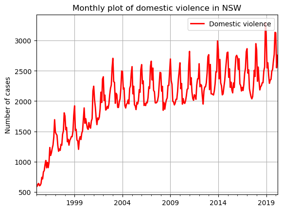


There are two ways to perform forecasting. The fist way is to decompose the time series (detrend and remove seasonal components) and then perform forecasting using models such as ARMA. The second way involves using models that account for trends and seasonality. An example is SARIMA.


```python
decomposed = seasonal_decompose(domestic, extrapolate_trend='freq')
decomposed.plot()
plt.show()
```


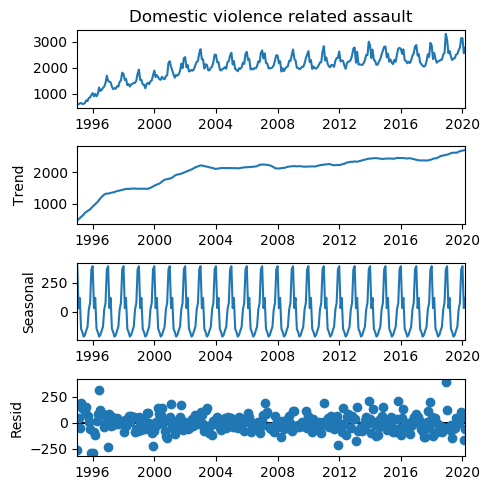


Decomposing the time series into three components makes it difficult to compose back in the forecasting stage. Let's just use Seasonal Autoregressive Integrated Moving Average (SARIMA). 

SARIMA has 6 parameters <font color=green>SARIMA Model (p, d, q) (P, D, Q, S)</font>
(p, d, q) are exactly the same as that of ARIMA. These are non-seasonal parameters.
(P, D, Q) are seasonal parameters and S is the period of seasonality. 

We can guess optimal values of the parameters from ACF and PACF data.


### 0th Order Differencing


```python
x = plot_acf(domestic, lags=100)
x = plot_pacf(domestic, lags=50)
```


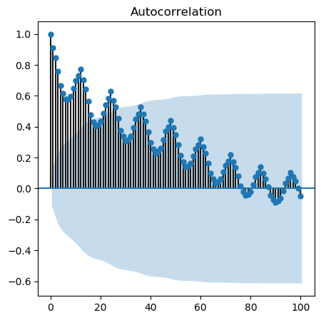


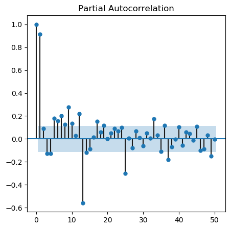


### 1st Order Differencing


```python
x = plot_acf(domestic.diff()[1:], lags=50)
x = plot_pacf(domestic.diff()[1:], lags=50)
```


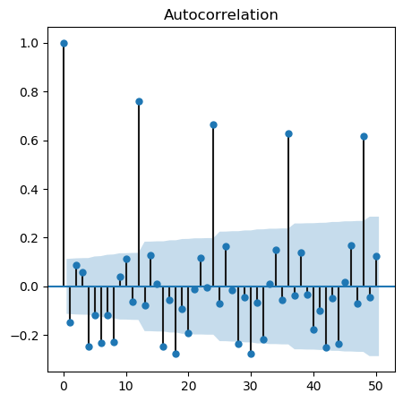


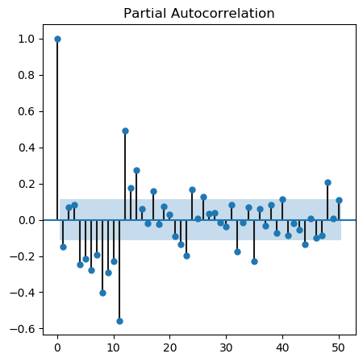


### 2nd Order Differencing


```python
x = plot_acf(domestic.diff().diff()[2:], lags=50)
x = plot_pacf(domestic.diff().diff()[2:], lags=50)
```


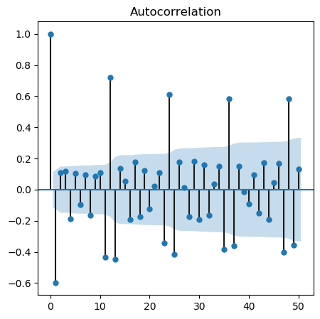


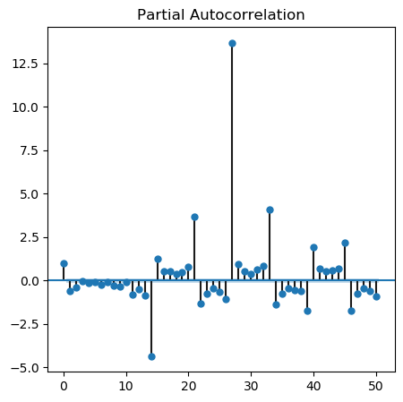


Since we can't conclusively derive the optimal values from the above plots, let's use a grid search.

## Splitting dataset


```python
len(domestic)
```


    303


The time series has 303 samples. Let's split into training and test sets.
1. Training <font color=green>The first 291 samples</font> (From January 1995 to March 2019)
3. Test set <font color=green>The final 12 samples </font> (From April 2019 to March 2020)


```python
trainingdata = domestic[:291]
testdata = domestic[291:]
```

### Optimization


```python
optimization = pm.auto_arima(trainingdata, 
                             start_p=1, max_p=24,
                             start_q=1, max_q=24,   
                             start_d=1, max_d=24, 
                             start_P=0, max_P=24,
                             start_Q=0, max_Q=24,
                             start_D=1, max_D=24, 
                             m=12,                                                      
                             seasonal=True,
                             trace=True,
                             error_action='ignore',  
                             suppress_warnings=True, 
                             stepwise=True)
```

    Fit ARIMA: order=(1, 1, 1) seasonal_order=(0, 0, 0, 12); AIC=3881.064, BIC=3895.744, Fit time=0.069 seconds
    Fit ARIMA: order=(0, 1, 0) seasonal_order=(0, 0, 0, 12); AIC=3884.404, BIC=3891.744, Fit time=0.011 seconds
    Fit ARIMA: order=(1, 1, 0) seasonal_order=(1, 0, 0, 12); AIC=3597.892, BIC=3612.571, Fit time=0.377 seconds
    Fit ARIMA: order=(0, 1, 1) seasonal_order=(0, 0, 1, 12); AIC=3734.927, BIC=3749.606, Fit time=0.176 seconds
    Fit ARIMA: order=(1, 1, 0) seasonal_order=(0, 0, 0, 12); AIC=3879.703, BIC=3890.713, Fit time=0.027 seconds
    Fit ARIMA: order=(1, 1, 0) seasonal_order=(2, 0, 0, 12); AIC=3573.378, BIC=3591.727, Fit time=0.981 seconds
    Fit ARIMA: order=(1, 1, 0) seasonal_order=(2, 0, 1, 12); AIC=3538.278, BIC=3560.297, Fit time=1.994 seconds
    Fit ARIMA: order=(1, 1, 0) seasonal_order=(3, 0, 2, 12); AIC=3542.807, BIC=3572.166, Fit time=4.134 seconds
    Fit ARIMA: order=(0, 1, 0) seasonal_order=(2, 0, 1, 12); AIC=3574.008, BIC=3592.358, Fit time=1.503 seconds
    Fit ARIMA: order=(2, 1, 0) seasonal_order=(2, 0, 1, 12); AIC=3530.884, BIC=3556.573, Fit time=2.530 seconds
    Fit ARIMA: order=(2, 1, 1) seasonal_order=(2, 0, 1, 12); AIC=3550.281, BIC=3579.640, Fit time=2.930 seconds
    Fit ARIMA: order=(3, 1, 1) seasonal_order=(2, 0, 1, 12); AIC=3535.030, BIC=3568.059, Fit time=2.800 seconds
    Fit ARIMA: order=(2, 1, 0) seasonal_order=(1, 0, 1, 12); AIC=3516.045, BIC=3538.064, Fit time=0.722 seconds
    Fit ARIMA: order=(2, 1, 0) seasonal_order=(1, 0, 0, 12); AIC=3576.686, BIC=3595.035, Fit time=0.363 seconds
    Fit ARIMA: order=(2, 1, 0) seasonal_order=(1, 0, 2, 12); AIC=3516.534, BIC=3542.223, Fit time=2.006 seconds
    Fit ARIMA: order=(2, 1, 0) seasonal_order=(0, 0, 0, 12); AIC=3879.948, BIC=3894.627, Fit time=0.038 seconds
    Fit ARIMA: order=(2, 1, 0) seasonal_order=(2, 0, 2, 12); AIC=3525.284, BIC=3554.643, Fit time=2.238 seconds
    Fit ARIMA: order=(1, 1, 0) seasonal_order=(1, 0, 1, 12); AIC=3539.602, BIC=3557.952, Fit time=0.450 seconds
    Fit ARIMA: order=(3, 1, 0) seasonal_order=(1, 0, 1, 12); AIC=3518.032, BIC=3543.721, Fit time=0.880 seconds
    Fit ARIMA: order=(2, 1, 1) seasonal_order=(1, 0, 1, 12); AIC=3542.510, BIC=3568.199, Fit time=0.890 seconds
    Fit ARIMA: order=(3, 1, 1) seasonal_order=(1, 0, 1, 12); AIC=nan, BIC=nan, Fit time=nan seconds
    Fit ARIMA: order=(2, 1, 0) seasonal_order=(0, 0, 1, 12); AIC=3736.832, BIC=3755.181, Fit time=0.220 seconds
    Total fit time: 25.835 seconds
    


```python
optimization.to_dict()
```


    {'pvalues': array([8.02974941e-01, 2.66197547e-18, 1.65880166e-07, 0.00000000e+00,
            3.81676032e-27, 6.26645855e-39]),
     'resid': array([ 6.00408692e+02, -2.33811464e+01,  1.69333208e+01,  1.99210137e+00,
            -4.28908986e+01, -2.95093089e+01, -3.84493902e-01,  9.69662627e+01,
             8.19964274e+00,  1.07567032e+02,  4.88632721e+01,  1.24848437e+02,
             7.38119534e+01, -9.12487444e+01,  2.26830930e+01, -1.06457866e+02,
             8.56968235e+01,  2.63299933e+02, -1.22669271e+01, -4.88990294e+01,
             2.67795534e+01, -1.29473201e+01,  1.16359578e+02,  2.47584770e+02,
            -1.31034793e+02, -1.47738960e+01, -1.31276024e+02, -1.60298247e+02,
            -2.09286912e+02, -1.83688194e+02, -4.99708201e+01,  2.23255840e+01,
            -1.60964242e+01,  9.55567284e+01,  1.42204522e+01,  1.40413814e+02,
             6.99392391e+01, -1.31473932e+02, -6.45563447e+01, -1.95508185e+02,
            -7.12234297e+00, -2.02163244e+02,  4.77633157e+01, -5.15271179e+01,
             3.85774763e+01, -1.19311965e+02, -2.23116803e+01,  1.27643813e+01,
             2.47627351e+02, -1.77729776e+02, -8.70769305e+01, -1.33959036e+02,
            -3.53424356e+01, -1.83141530e+02,  8.03991988e+01,  1.26257590e+01,
            -2.50222060e+01, -3.83426692e+00, -4.36326585e+01, -5.73540875e+01,
             1.51708749e+02,  2.43906218e+01,  8.37690863e+01,  7.53344721e+01,
            -2.42814742e+01, -3.93101392e+00,  4.12010469e+01, -9.64139143e+01,
            -5.94409518e+01, -1.30950823e+01, -1.26615108e+01,  2.44771769e+02,
             1.15333937e+02,  7.33879087e+01, -1.63746748e+02, -1.28666320e+02,
            -1.62584293e+02,  8.15008746e+01, -6.42827885e+01,  2.19192533e+01,
             1.28417235e+02,  2.60839956e+02, -9.69856099e+01,  4.49763146e+01,
            -5.59418464e+01, -1.63292330e+02,  9.44782412e+00, -1.13718618e+02,
             4.72523517e+01,  2.86903438e+01, -3.85566574e+01,  2.41295152e+01,
             1.12997300e+02,  2.71838239e+01,  8.64823811e+01, -8.27793724e+00,
             1.00945622e+02, -8.16520564e+01, -5.85843288e+01, -2.25812013e+02,
             1.05172547e+02, -1.13581757e+01, -1.90840618e+02, -1.59164889e+02,
            -6.30892314e+01, -9.00584973e+01,  1.37396440e+02,  3.29483788e+01,
            -5.49464775e+01, -3.97414794e+01, -1.61790224e+01, -6.06631384e+01,
            -1.00824745e+02, -2.96997774e+00,  7.44442913e+01,  7.80425837e+01,
            -1.08670998e+02,  9.26107996e+01,  8.88462760e+00, -4.56928112e+01,
             5.32414240e+00, -1.56093734e+02,  5.53983679e+01, -5.88655717e+01,
            -2.52204519e+01, -1.18377035e+02,  1.00724938e+02, -1.57773580e+01,
             4.35123136e+01,  1.99738569e+01, -7.72052083e+01,  7.42856203e+01,
             3.36024307e+01,  6.15012511e+01,  1.18657421e+01, -1.40277741e+02,
            -3.83488391e+01, -6.15152460e+01,  3.11860601e+01, -1.68157629e+01,
             4.32552895e+01,  3.63074015e+01, -2.66554377e+01,  5.12971012e+01,
             3.04963914e+01,  4.35465609e+01,  1.61100937e+02,  6.08750617e+00,
            -1.68084182e+01, -2.08278897e+02, -1.20792296e+02, -6.30515404e+01,
            -2.94618202e+01, -9.92846016e+01,  1.37071287e+02, -5.47680888e+01,
            -8.47369848e+01, -6.02048645e+01, -3.39490172e+01, -7.88875992e+01,
             8.58987933e+01, -6.91836580e+00,  9.28750754e+01,  7.65164005e+01,
             3.05428256e+01,  8.28906253e+01, -3.67515675e+01, -6.75608497e+01,
             1.28514125e+02,  1.47819286e+01, -1.22659106e+02, -2.56715113e+01,
            -6.95607885e+01,  2.31251850e+01, -1.43891461e+01,  3.98123805e+01,
            -2.68137323e+01, -3.61176972e+01,  1.36150481e+02, -5.14088914e+01,
             2.93431751e+01, -1.27919257e+02,  6.22600617e+00, -3.70167779e+01,
             6.95170450e+01,  2.47317195e+01, -3.04970855e+01, -1.83451042e+01,
             4.21546451e+01, -6.99131310e+00, -8.51157234e+01,  1.41505268e+02,
             1.65184230e+02, -9.78848918e+01, -1.25848436e+00,  5.05401137e+01,
            -9.36762977e+01, -1.06057568e+01,  4.10418661e+01, -1.19767911e+01,
            -1.08263343e+02,  3.58062632e+01,  5.59813767e+01, -2.14849966e+02,
            -9.78221346e+00, -3.53627971e+00,  7.91947954e+00,  2.62592058e+02,
            -6.02317899e+01, -7.54036992e+01,  8.32742219e+01,  1.04410979e+02,
             6.48944638e+01, -8.44949172e+01,  4.02887630e+01,  1.01325961e+02,
            -7.63489570e+01, -2.25746370e+02,  2.26252617e+02, -1.77809462e+02,
             2.90700930e+01,  9.27280442e+00, -5.80437426e+01,  4.38801732e+00,
             9.04035801e+01,  1.29501057e+02, -4.14532492e+01,  2.79401258e+02,
            -1.59404498e+02, -7.29177627e+01,  4.82255561e+01, -4.54026833e+01,
            -1.27757294e+01, -1.30320729e+02, -9.31807103e+01,  1.95130966e+01,
             7.53537176e+01,  6.42820259e+01,  1.04103821e+02, -1.07155654e+02,
            -7.66251396e+01, -2.33821558e+01, -6.98972809e+01, -1.79245351e+01,
             1.06756047e+02,  1.42386964e+01, -7.68473358e+01,  3.95281528e+01,
            -1.18392211e+02,  9.59962521e+01,  1.49206715e+02, -1.23399224e+02,
            -1.30947748e+02,  1.38422226e+02,  7.67363455e+01, -4.35724520e+01,
            -8.20332986e+01, -3.85156726e+01,  3.81582472e+01, -1.26969815e+02,
             2.72570668e+01, -1.43025338e+01, -2.91093262e+01,  7.25885670e+01,
             7.28122587e+01, -2.94334359e+00, -1.40613972e+02, -5.15938382e+01,
            -8.92824352e+01,  8.10074850e+00, -6.79557329e+01, -3.21566347e+01,
             1.07024543e+02,  1.31401103e+02, -1.45774250e+02,  2.60009140e+02,
            -3.10636709e+01, -1.12095830e+02, -1.63041383e+01,  9.46590756e+01,
            -4.81049771e+01,  1.08138970e+02,  3.21980469e+01,  4.76565717e+01,
            -8.13344542e+01, -4.97555636e+01, -1.27652917e+01,  4.30846282e+02,
            -5.44982097e+00, -8.32657215e+01, -1.99580999e+02]),
     'order': (2, 1, 0),
     'seasonal_order': (1, 0, 1, 12),
     'oob': nan,
     'aic': 3516.045164705489,
     'aicc': 3516.440924422803,
     'bic': 3538.064450243372,
     'bse': array([1.28292065e+00, 5.35558965e-02, 5.70942722e-02, 9.48227883e-03,
            6.18336761e-02, 7.29344317e+02]),
     'params': array([ 3.20087208e-01, -4.67274812e-01, -2.98831439e-01,  9.85606028e-01,
            -6.67216745e-01,  9.51872066e+03])}


The optimal values for (p, q, d)(P, Q, D, S) are (2, 1, 0) (1, 0, 1, 12) respectively.


```python
model = sm.tsa.statespace.SARIMAX(endog=trainingdata,
                                  order=(2,1,0),
                                  seasonal_order=(1,0,1,12),
                                  trend='c')
```


```python
residue = model.fit(disp=False)
print(residue.summary())
```

                                           SARIMAX Results                                       
    =============================================================================================
    Dep. Variable:     Domestic violence related assault   No. Observations:                  291
    Model:              SARIMAX(2, 1, 0)x(1, 0, [1], 12)   Log Likelihood               -1752.023
    Date:                               Sun, 16 Aug 2020   AIC                           3516.045
    Time:                                       16:24:07   BIC                           3538.064
    Sample:                                   01-01-1995   HQIC                          3524.867
                                            - 03-01-2019                                         
    Covariance Type:                                 opg                                         
    ==============================================================================
                     coef    std err          z      P>|z|      [0.025      0.975]
    ------------------------------------------------------------------------------
    intercept      0.3201      1.283      0.249      0.803      -2.194       2.835
    ar.L1         -0.4673      0.054     -8.725      0.000      -0.572      -0.362
    ar.L2         -0.2988      0.057     -5.234      0.000      -0.411      -0.187
    ar.S.L12       0.9856      0.009    103.942      0.000       0.967       1.004
    ma.S.L12      -0.6672      0.062    -10.791      0.000      -0.788      -0.546
    sigma2      9518.7207    729.344     13.051      0.000    8089.232    1.09e+04
    ===================================================================================
    Ljung-Box (Q):                       54.59   Jarque-Bera (JB):                32.37
    Prob(Q):                              0.06   Prob(JB):                         0.00
    Heteroskedasticity (H):               1.19   Skew:                             0.50
    Prob(H) (two-sided):                  0.39   Kurtosis:                         4.29
    ===================================================================================
    
    Warnings:
    [1] Covariance matrix calculated using the outer product of gradients (complex-step).
    

### In-sample testing


```python
prediction = residue.predict()
trainingdata.plot(kind = 'line', color = 'red',label = 'Actual',linewidth=2,alpha = 1,grid = True,linestyle = '-')
prediction.plot(kind = 'line', color = 'blue',label = 'Prediction',linewidth=2,alpha = 1,grid = True,linestyle = '-')
plt.legend(loc='upper right')     
plt.xlabel('')              
plt.ylabel('Number of cases')
plt.title('')            
plt.show()
```


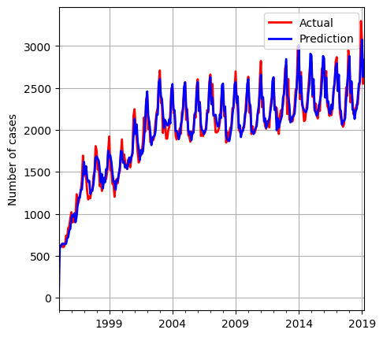


It looks good. It's zoom into last 48 months of the training data to see more clearly.


```python
trainingdata[-48:].plot(kind = 'line', color = 'red',label = 'Actual',linewidth=2,alpha = 1,grid = True,linestyle = '-')
prediction[-48:].plot(kind = 'line', color = 'blue',label = 'Prediction',linewidth=2,alpha = 1,grid = True,linestyle = '-')
plt.legend(loc='upper right')     
plt.xlabel('')              
plt.ylabel('Number of cases')
plt.title('In-sample testing')            
plt.show()
```


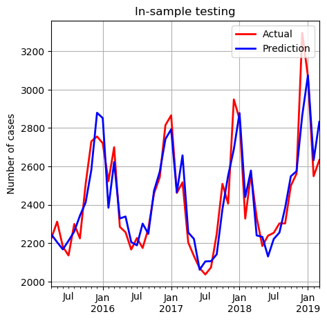


The in-sample performance looks great.

### Out-of-sample testing

The model was trained with samples from January 1995 to March 2019. Let's perform out-of-sample forecasting.
Let's make the model predict the next 12 samples (From April 2019 to March 2020) and compare with the test data (which were not included in the training stage)


```python
predictions = residue.forecast(12)
print(predictions)
```

    2019-04-01    2417.477994
    2019-05-01    2342.035229
    2019-06-01    2287.142509
    2019-07-01    2309.648395
    2019-08-01    2355.166009
    2019-09-01    2408.743951
    2019-10-01    2611.234821
    2019-11-01    2661.803226
    2019-12-01    3100.692777
    2020-01-01    3017.321312
    2020-02-01    2580.126414
    2020-03-01    2719.261632
    Freq: MS, dtype: float64
    


```python
testdata
```


    2019-04-01    2434
    2019-05-01    2294
    2019-06-01    2347
    2019-07-01    2359
    2019-08-01    2495
    2019-09-01    2525
    2019-10-01    2661
    2019-11-01    2772
    2019-12-01    3135
    2020-01-01    3128
    2020-02-01    2550
    2020-03-01    2757
    Name: Domestic violence related assault, dtype: int64


The numbers look very similar. Let's plot them.


```python
testdata.plot(kind = 'line', color = 'red',label = 'Actual',linewidth=2,alpha = 1,grid = True,linestyle = '-')
predictions.plot(kind = 'line', color = 'blue',label = 'Prediction',linewidth=2,alpha = 1,grid = True,linestyle = '-')
plt.legend(loc='upper right')     
plt.xlabel('')              
plt.ylabel('Number of cases')
plt.title('Out-of-sample testing')            
plt.show()
```


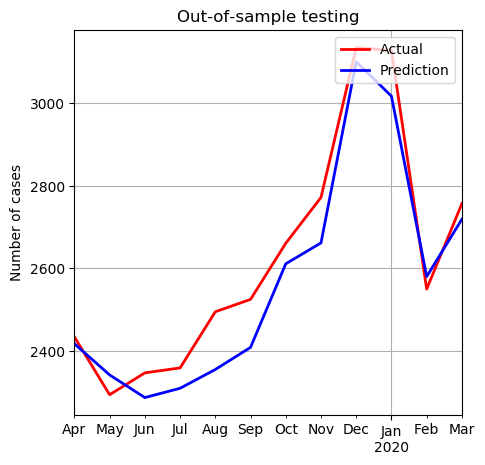


```python
The predictions are remarkably accurate!
```

# Out-of-dataset prediction (Foreseeable future)

Let's retrain with all the data (303 samples) and let the model perform forecasting for the next 5 years.


```python
final_model = sm.tsa.statespace.SARIMAX(endog=domestic,
                                  order=(2,1,0),
                                  seasonal_order=(1,0,1,12),
                                  trend='c')

final_residue = final_model.fit(disp=False)
```


```python
final_predictions = final_residue.forecast(60) #5 years = 60  months
print(final_predictions)
```

    2020-04-01    2508.661812
    2020-05-01    2397.454634
    2020-06-01    2396.424219
    2020-07-01    2411.389145
    2020-08-01    2480.721161
    2020-09-01    2529.679840
    2020-10-01    2708.566465
    2020-11-01    2777.309513
    2020-12-01    3184.204534
    2021-01-01    3127.830831
    2021-02-01    2653.196033
    2021-03-01    2812.327381
    2021-04-01    2561.156665
    2021-05-01    2467.748629
    2021-06-01    2461.099624
    2021-07-01    2474.092595
    2021-08-01    2545.277921
    2021-09-01    2593.087005
    2021-10-01    2769.318661
    2021-11-01    2837.719480
    2021-12-01    3239.297060
    2022-01-01    3183.759486
    2022-02-01    2715.686093
    2022-03-01    2872.864118
    2022-04-01    2625.198972
    2022-05-01    2533.216817
    2022-06-01    2526.828920
    2022-07-01    2539.817596
    2022-08-01    2610.226388
    2022-09-01    2657.569875
    2022-10-01    2831.622458
    2022-11-01    2899.282908
    2022-12-01    3295.676540
    2023-01-01    3241.051335
    2023-02-01    2779.392306
    2023-03-01    2934.645838
    2023-04-01    2690.455489
    2023-05-01    2599.871830
    2023-06-01    2593.740875
    2023-07-01    2606.728069
    2023-08-01    2676.369579
    2023-09-01    2723.253401
    2023-10-01    2895.156424
    2023-11-01    2962.086246
    2023-12-01    3353.364999
    2024-01-01    3299.640066
    2024-02-01    2844.309840
    2024-03-01    2997.664532
    2024-04-01    2756.902648
    2024-05-01    2667.698832
    2024-06-01    2661.821391
    2024-07-01    2674.807123
    2024-08-01    2743.691583
    2024-09-01    2790.121872
    2024-10-01    2959.904003
    2024-11-01    3026.112941
    2024-12-01    3412.345031
    2025-01-01    3359.508363
    2025-02-01    2910.422534
    2025-03-01    3061.903711
    Freq: MS, dtype: float64
    


```python
domestic.plot(kind = 'line', color = 'red',label = 'Current data',linewidth=2,alpha = 1,grid = True,linestyle = '-')
final_predictions.plot(kind = 'line', color = 'blue',label = 'Forecast',linewidth=2,alpha = 1,grid = True,linestyle = '-')
plt.legend(loc='upper right')     
plt.xlabel('')              
plt.ylabel('Number of cases')
plt.title('Out-of-dataset prediction')            
plt.show()
```


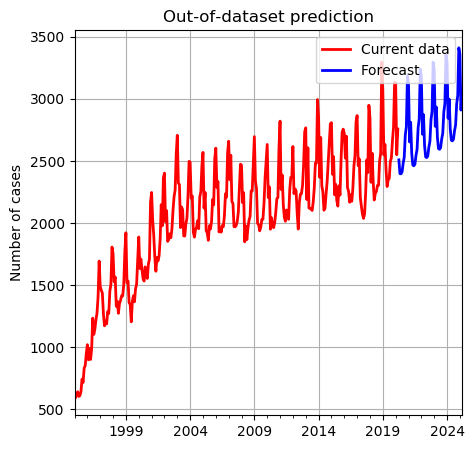


# Conclusion

As depicted in the figure above, domestic violence in NSW will most likely continue to rise in the next 5 years unless the NSW government pays attention to it and takes aggressive countermeasures.
